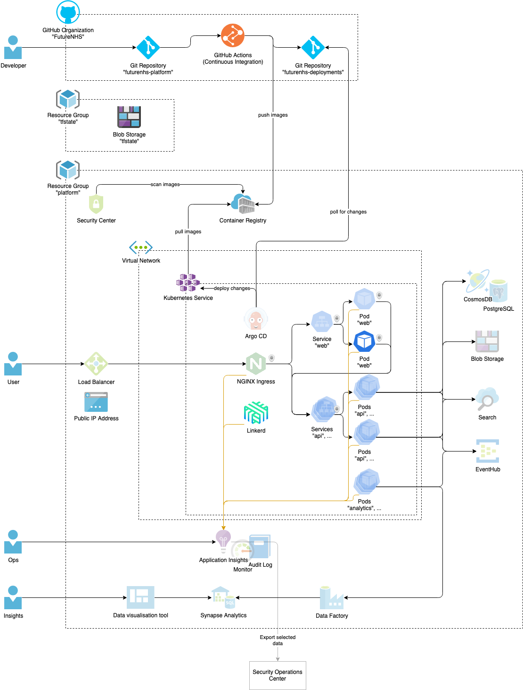

# Architecture

## High level diagram

This represents the current plan. Some parts are not implemented, yet (transparent in the picture) and may be subject to change.

- Developers interact with two Git repositories "futurenhs-platform" and "futurenhs-deployments"
- Continuous integration builds Docker images and pushes them to a Container Registry
- Resources are hosted in Azure and are split into the resource groups "tfstate" and "platform"
- Applications are deployed to a Kubernetes cluster, which sits inside a private Virtual Network
- Argo CD deploys applications to the cluster based on changes in the "futurenhs-deployments" repository (TODO)
- Traffic inside the cluster uses mutual TLS provided by Linkerd (TODO)
- A public load balancer connects to an NGINX ingress controller in the cluster and is the only entry point to the cluster (TODO)
- All applications send metrics and traces to Application Insights (TODO)
- Applications access CosmosDB, Blob Storage, Search and EventHub (TODO)
- Analytics data is sent through Data Factory to Synapse Analytics (TODO)

## Change process and approvals

Our [testing approach](../testing/test_approach.md) outlines how we can safely bring changes to the product in front of our users. Measures like code reviews, automated testing and exploratory testing on the production environment using feature flags minimize the number of bugs we introduce. Avoiding bugs entirely, however, is impossible. We keep the process lean and fast so we can quickly fix bugs, which do make it in front of users.

Feature flags also let us separate deployments from releases. Deployments only need minimal sets of approvals and be done quickly many times a day. A deployment does not need to result in a change visible for end users. Releases toggle feature flags to make a change visible to a number of end users. They can be performed by the product owner once documentation and training material is available and necessary approvals have been given.
